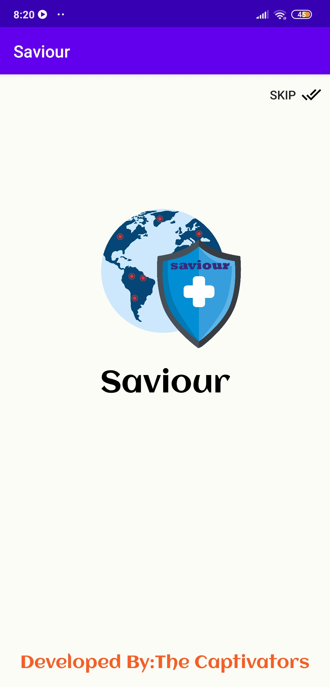
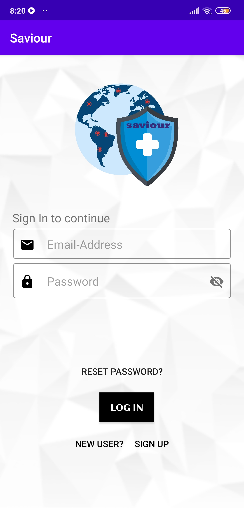
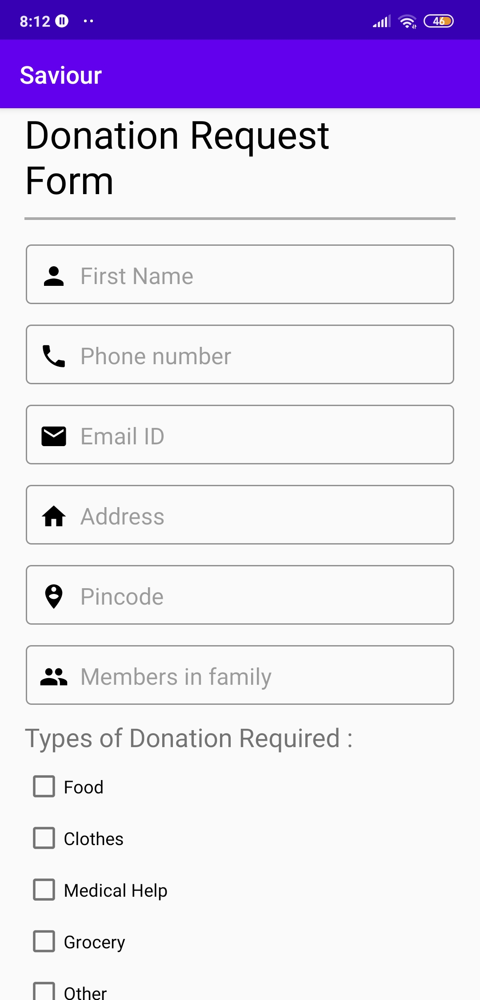
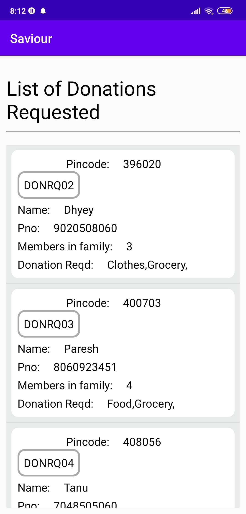
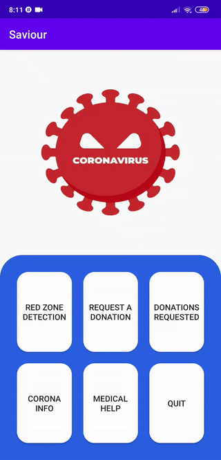
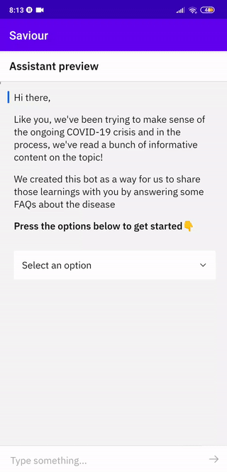
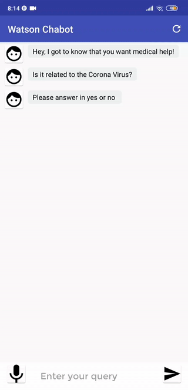

# Saviour Android app


During the pandemic, it has been a major challenge for the communication systems and websites which are often overloaded with people trying to find basic information about testing, symptoms, community response, and other resources. When this communication line gets clogged, people who need real help can't get through. This app will provide a chatbot for its users to find hospitals, information, symptoms, and prevention of the spread of COVID-19. Additionally, there is a section where users (below poverty line) can request a donation of various daily necessities. Additionally, it can track and send you an alert if you are in a red zone.

## Installation
This app currently can only run on SDK 28(Android 9) and above. We'll add more compatibility in the future
#### Prerequisite
Install Watson Chatbot app from <a href="https://drive.google.com/file/d/1Y1z6gnO7PNHxqU1eNRwS4fI9Q4Bu75Q6/view?usp=sharing">here.</a>

#### To directly install on an Android phone:
Download apk from Google Drive link : 
<a href="https://drive.google.com/file/d/1JORfBi1Yl74sKOnw9c5pnnMcaq_hrbkx/view?usp=sharing">Saviour App</a>

#### To run on an emulator using IDE:
Clone this repository and import into **Android Studio**
```bash
git clone https://github.com/dhy3y/Saviour.git
```
Please use:
- Latest Android SDK tools
- Latest Android platform tools
- An emulator with SDK 28 or above (we are working with lower android versions too)
- NDK version 20


## Features
This app
- Alerts you via toast and notification when a user enters a Red zone Area ( Red zone detector )
- Helps Poor people to request a Donation for essential material like food, clothes, groceries, etc (Request a Donation portal)
- Acts as a bridge between the poor people and the Users.  The user can help the needy by Donating essential material ( List of all the Requested Donations )
- Has Watson Assistant Chatbot to provide Coronavirus information and Medical help to the user ( Corona Info and Medical Help)
- Completely ad-free
- User friendly and easy to use


## Screenshots
  
#### Preview - features
 
<br>    


## Permissions
Our app requires the following permissions:
- Full Internet Access (to submit/display donation request)
- Microphone (For Watson Chatbot)
- Access to fine location (for red zone alert)
- Access to background location (for red zone alert)

## Contributing
Saviour app is a free and open-source project developed by our team. Your contributions are always welcome!
Here are a few ways you can help:
- Report bugs and make suggestions
- Write some code for a new feature (Please follow the code style used in the project to make a review process faster)
- Finding a dataset which contains coordinates of all the red zones in India
- Translate the app

**To contribute, you can send an email to** dhyeydoshi2512@gmail.com / pareshgharat6890@gmail.com
